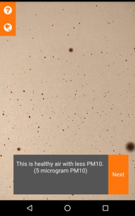

# Visualizing Air Quality

The project and code is also availble on Github: https://github.com/KathHv/VisualizingAirQuality

## Project Idea
* Visualise the uncertainty associated with data collected from the two official stations
* Plot routes around the two stations for the bike, ride those routes once or more times
* The bike data will show how well the station predicts the measurements surrounding the station
* Part I: Turn this into a scrollytelling story about uncertainty and reliability of stationary air quality measurements: Air quality is in the news and most people never question how it is measured. We can educate them on how the measurements are made and how meaningful they really are.
  * Technology: Website made with HTML, CSS, JavaScript, D3, Leaflet
* Part II: Create an AR application with which people can walk around the station and see the air quality visualized as a "mist" to provide a more playful way of interacting with the data
  * Technology: Unity, City Engine, maybe SketchUp -> switched to webbased AR.js

## The Scrollytelling Website
* Link: https://kathhv.github.io/VisualizingAirQuality

### Tutorial
The scrollytelling website is a comprehensive look into the uncertainties and misrepresentations of air quality measurement. After the preliminary description, the website contains three coloured blocks each with a brief description of an uncertainty chapter.

The website offers the following functionalities -

* Navigate through an interactive explanation of uncertainties associated with air quality measurements by scrolling through the page. The visualization on the right will update, corresponding to the text panel on the left, as you scroll through the page.
* Click on any one of the coloured blocks to skip or move to that specific uncertainty chapter.
* Scrolling back/up reloads the previous visualizations.

### Bugs and Limitations
* The website is not optimised for mobile devices.

## The AR Web Application
* Link: https://kathhv.github.io/VisualizingAirQuality/AR

### Tutorial
The AR application is an entirely browser-based app. The app can be accessed from the link above or through the QR code at the end of the scrollytelling website. On initialization, The app gives preliminary description of the air quality measurements and a comparative representation of high and low PM10 values.

The guide to using the app is as follows -

*	Allow camera and sensor permissions as well as location accessibility.
*	Click the “Next” button at the bottom of the screen. (For Safari users the button is not visible but clicking on the bottom right corner on the screen works. (See picture below)
*	The application displays particles on the screen corresponding to the PM10 value at the user’s location. As the user moves, the location is continuously updated, so are the PM10 values.
*	The arrow at the bottom of the screen points to the next data point.
*	The panel below the arrow displays the user’s distance from the closest data point. Click on the panel to access Google maps for navigation.
* The gauge on the right displays the PM10 value at the user’s location and the PM10 measurement from the official station at Geist.
* The top left corner contains the link to the scrollytelling website and the button for choosing a different dataset.
* On the location where we measured there are several guide areas. These are marked at their respective location with differently coloured toruses. Once you get close enough to the location of such a guide area a button will appear at the top right corner. Upon clicking this button an explanatory text about some feature at your location will pop up.

#### It should be noted that the app displays historical data from the mobile sensor and LANUV. The date can be seen on the change dataset button on the top left.

### Bugs and Limitations
* For Safari users the "Next" Button in the introduction is not visibile but clicking where the button should be works.

* Oftentimes the guide areas are not visible, but the option for explanatory text will still be available, once you get close enough to one.
* There are only proper guide areas for the bike trip which we took on the 14th of november. For the other trip we only added demo guide areas which are located around the GEO1 building, and contain demo texts.
* If the arrow is pointing in the wrong direction try recalibrating the orientation of your device (e.g. using the google maps app).

## Overview of this repository
* **AR**: HTML, CSS and JS files required for the AR app
* **R**: R code used for data analysis
* **data**: Data files of the LANUV, bike, and SenseBox data
* **img**: Images used across the two web apps
* **lib**: Contains a library required for the scrollytelling page, which could not be loaded from a CDN
* **scrollymaps**: Contains CSS and JS files required for the Scrollytelling web page
* **shared**: Contains JS code shared between the two apps
* index.html: HTML for the scrollytelling page

## References:
* image stickman: https://www.needpix.com/photo/19195/matchstick-man-man-stickman-stick-figure-character-question-helpless-gesture-hands
* image guestion mark: https://pixabay.com/vectors/the-question-mark-sign-question-ask-350170/
